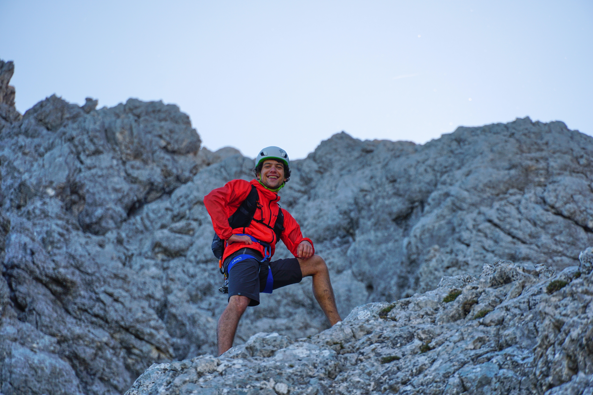

My name is Max.
Typically, I would describe myself as a mathematician, alpinist and research engineer.

- mathematically, i am interested in geometry, dynamics, probability and their interactions.

- as an alpinist, my interests are mountaineering, climbing and ski-touring with a focus on the eastern alps.

- finally, as a research engineer, i am interested in developments in machine learning.

My current homebase is Innsbruck, Tyrol. 

I hold a BSc in mathematics from the University of Augsburg and a MSc in mathematics from the Technical University of Munich (TUM). Afterwards, I started a PhD in mathematics at TUM, which is yet to be completed. Currently, I am working at MED-EL.

You can reach me via [5-letter-blog-title]@icloud.com.

