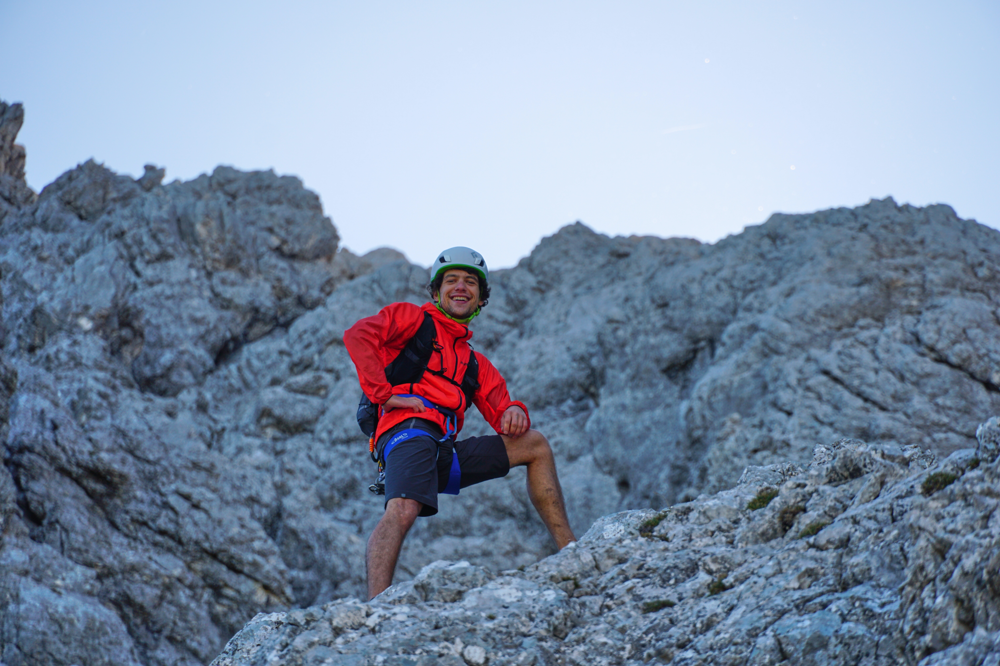

I am a mathematician and mountain enthusiast.

- Mathematically, I am broadly interested in geometry, dynamics, probability and their interactions,

- as a mountain enthusiast, I like alpinism and enjoy being outside with friends, mostly [mountaineering, climbing and ski-touring](https://mxstn.github.io/mountains),

- finally, in my current job as research engineer, I am interested in python, statistics and developments in machine learning.

I hold a MSc in mathematics from the Technical University of Munich (TUM). Currently, I am finishing a Dr. rer. nat. (~PhD) in mathematics at TUM, my main supervisor is [Christian Kuehn (multiscale and stochastic dynamics)](https://multiscale.systems) and my co-supervisor is [Hildeberto Jardón-Kojakhmetov (dynamical systems)](https://hildejk.xyz). My mathematical research is concerned with singularities in differential equations with two time-scales and geometric methods in the analysis of their dynamics. To get a glimpse of my mathematical research check out [my paper "the hyperbolic umbilic singularity in fast-slow systems"](https://iopscience.iop.org/article/10.1088/1361-6544/ad6bde).

You can reach me via [5-letter-page-title][at]icloud.com

