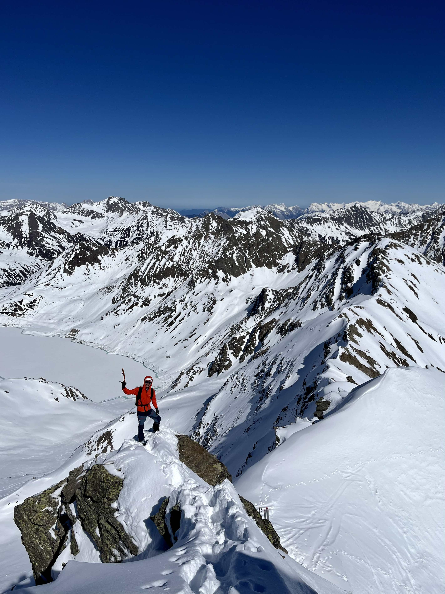
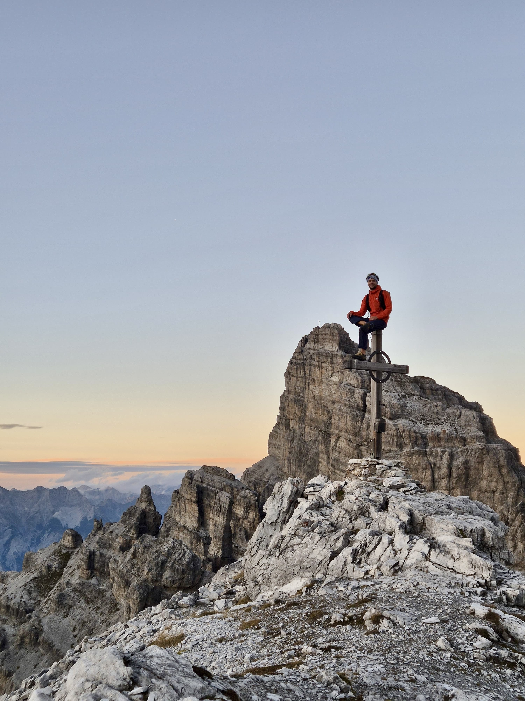
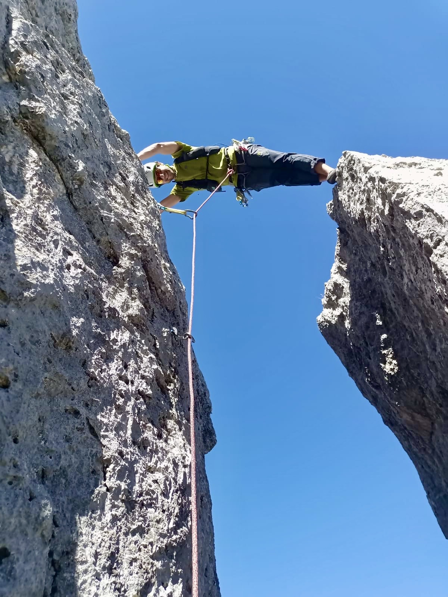
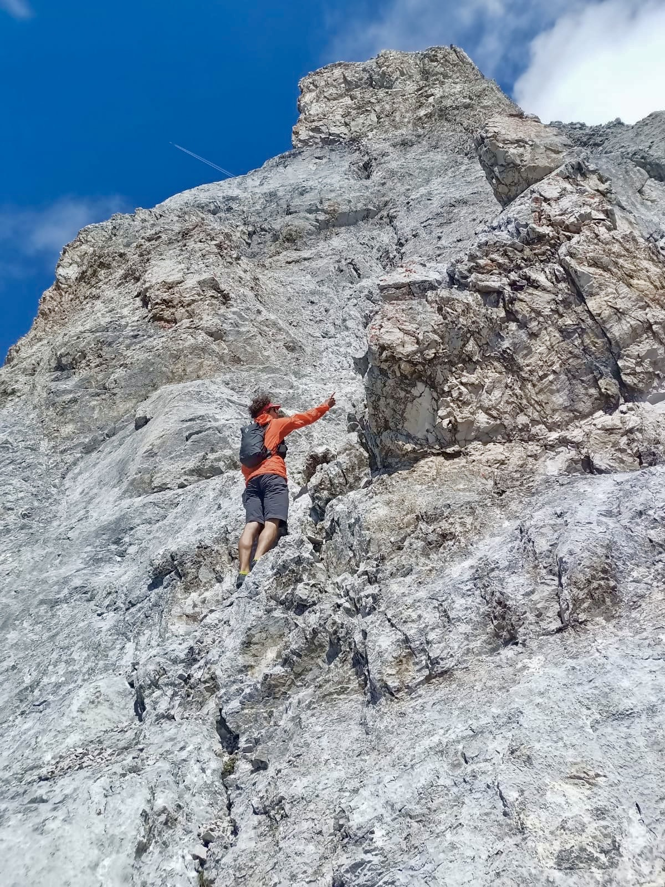

  
  
  
  

I am a mountain enthusiast currently living in Innsbruck, Tyrol. I grew up in the bavarian alps, in Garmisch-Partenkirchen.

In winter I like to do ski-touring, in summer I enjoy ridge scrambling or alpine climbs. I love the simplicity and the feeling of remoteness, roughness and adventure in the mountains. I am grateful for all the friends that joined on most of these adventures, and the amazing times we shared together :)
My strengths are fast movement in alpine, rocky terrain up to UIAA grade 4 and navigation through pathless, alpine environment. Recently, I started paragliding.

Below, I tried to collect more or less the peaks and routes I have done so far.

## Wetterstein

- Alpspitz
	- Sonntagsausflug (5)
	- Adamplatte (4-, solo)
	- Nordwandxicht (6)
	- Nebelpartie (6-)
	- Jubiläumsgrat (Zugspitz -> Alpspitz) sub 3h
	- new years eve bivy on top
- Hochblassen
	- Blassengrat (3) followed by Jubiläumsgrat (3-)
- Partenkirchner Dreitorspitz
	- traverse (3-, solo by bike from Garmisch-P. in sub 8h round trip)
- Leutascher Dreitorspitz (ski)
- Kämikopf, Kämitor, Schachentor (ski)
- Wettersteinwand
- Musterstein
	- traverse from Obere Wettersteinspitze "Wettersteingrat" (3)
- Öfelekopf
	- traverse from North-East face to West ridge (3)
- Schüsselkar Westgratturm
	- Siemens/Wolf with Phantasia entry (5-/5+)
- Oberreintalschrofen
	- traverse from East ridge to West (3)
	- Oberreintalkar (ski)
- Teufelskopf
- Hinterreintalschrofen
- Hochwanner
- Kleiner Waxenstein
	- traverse
- Großer Waxenstein
	- Nonnebruch/Schlagintweit (3, solo)
	- traverse from Zwölferkopf (3, solo)
- Hinterer Waxenstein
	- traverse "Waxensteingrat" (3) from Gr. Waxenstein via Schönangerspitz, Riffelspitzen to Riffeltorkopf
- Große Riffelwandspitz
	- traverse via east-ridge from Kleine Riffelwandspitz to Zugspitz (4-)
- Riffeltorkopf
	- Ettl-Platte (5+)
	- Maus, Tiger, Käfer (4+)
- Höllentorkopf
	- Nord-Kante (4)
- Arnspitzen
	- traverse (3-)
- Zugspitz
	- Jubiläumsgrat (3-) four times, twice solo
		- Zugspitz -> Alpspitz in sub 3h
		- Blassengrat (3) followed by Jubiläumsgrat
		- Adamplatte (4-, solo) followed by Jubiläumsgrat
		
		
## Mieminger Kette

- Ehrwalder Sonnenspitz
- Igelskopf Hüttenrinne (ski)
- Wampeter Schrofen
	- North ridge (solo)
- Wannig (ski)
- Hohe Wand
	- East ridge from Karkopf (3, solo)
- Grünstein 
	- Eeast ridge traverse
- Tajakopf
	- Drachentanz (6)
- Drachenkopf
	- Walk to paradise (5)

## Karwendel

- Kreuzwand
	- East ridge (3)
	- MaMa Kante (5)
	- Joe Muff (4+)
- Koflerturm
	- South-west ridge (5+)
- Gerberkreuz
	- South-west ridge (4)
- Vordere/Hintere Brandjochspitz
	- South ridge (3-, solo, round trip from Innsbruck in 5.5h)
- Hohe Warte
	- South ridge (4)
- Kleiner Solstein
	- East ridge (3, solo)
- Pfeiserspitz (traverse)
- Lamsenspitz
	- Nord-Ost Kante (4+)
- Hintere Bachofenspitze
	- traverse from Stempeljochspitz via Roßkopf (3) (from Innsbruck by bike in 10h round trip)
- Fiechter Spitz
	- traverse to Mittagsspitz, Schneekopf (3)
- Großer Bettelwurf
	- Osteck (3)
	- Normalweg from Innsbruck by bike in 7h round trip
-  Fallbachkarspitz 
	- South ridge (3, solo)
	
- Große Seekarspitz (ski)
- Pleisenspitz (ski)
- Freiungspitzen (ski)
- Erlscharte (ski)
- Seefelder Spitz (ski)
- Kemacher (ski)
- Grubenkarspitz
- Kaltwasserkarspitz (by bike from Garmisch-P.)
- Ödkarspitzen
- Birkkarspitzen
- Östl. Karwendelspitz
- Rotwandlspitz - Westl. Karwendelspitz traverse
- Erlspitz
- Wörner
- Soiernspitz (traverse from Seinskopf)
- Kaskarspitz
- Sattelspitzen
- Reither Spitz
- Rumer Spitz (traverse), Gleirschtaler Brandjoch, Mandlspitz

## Zillertaler Alpen

- Turnerkamp
	- South ridge (5)
- Großer Möseler
	- South ridge (3) via Möselekopf
- Gigalitz
	- Gigalitzturm South-east (5-)
- Hoher Weißzint
	- East ridge (3) from Neves lake
- Olperer north ridge (ski)
- Großer Kaserer traverse (ski)
- Reichenspitze (ski)
- Fußstein 
	- West ridge "Hüttengrat" (4)

## Hohe Tauern

- Großvenediger
	- North ridge (4-) with fresh snow in autumn
- Westl. Simonyspitz (ski)
- Großer Geiger (ski)

## Ötztaler Alpen

- Watzespitz
	- East ridge (4) up and down from Plangeross in 11h total
- Verpeilspitz
	- North ridge (4+) from Verpeilalm carpark in 9.5h total
- Rofelewand (ski)
- Hochfirst (ski)
- Liebenerspitz (ski)
- Granatenkogel (ski)
- Königskogel from west (ski)
- Wildspitz 
	- bike&ski from Mandarfen
	- Jubiläumsgrat (north-east ridge) traverse
- Hinterer Brochkogel (ski)

## Bündner Alpen

- Cima dal Cantun
	- traverse via Caciadur, Scälin (3)
- Piz Balzet
	- South ridge (4+)
- Piz Bernina
	- Bianco ridge (3)
- Piz Palü 
	- traverse
	
	
## Ortleralpen

- Ortler
	- Hintergrat (4) from Sulden in fresh autumn snow
- Cevedale, Nördl. Zufallspitz (ski)
- Cima Marmotta (ski)
- Madritschspitz (ski) 
- Butzenspitz (ski)

## Silvretta and Verwall

- Großlitzner, Großes Seehorn
	- traverse (4)
- Blankahorn 
	- West ridge (3, solo)
- Hoher Riffler
- Dreiländerspitze (ski)
- Mittlerer Chalauskopf north couloir (ski)
- Patteriol
	- North-east ridge (4)
- Schneeglocke

## Stubaier Alpen

- Wilde Leck 
	- East ridge (4) from Gries by bike
- Habicht 
	- by bike from Innsbruck in 10h round trip
	- by ski from north
- Lisener Fernerkogel
	- North ridge (3-) solo up and down
	- by ski
- Peider Spitz
	- Norh ridge via Schlossköpfe (3, solo)
	- East ridge
- Acherkogel
	- North-east ridge (4) up and down
- Wilder Freiger
	- traverse from Aperer Freiger, solo
- Gänsekragen
	- East ridge (3+, solo) in 4h total up and down from Gries
- Ruderhofspitz (ski from south)
- Hinterer Brunnenkogel (ski)
- Wörgegratspitz (ski)
- Serles, Lämpermahdspitz, Kesselspitz from Kappl
- Kirchdachspitz, Hammerspitz, Wasenwand by bike from Steinach
- Kesselspitz (ski)
- Nockspitz 
	- North couloir (ski, solo)
	- West couloir (ski, solo)
- Marchreisenspitz (ski)
- Ampferstein (ski)
- Hochtennspitz
- Angerbergkopf (ski)
- Rinnenspitz
- Lisener Villerspitz
- Lisener Fernerkogel (ski)
- Zischgeles (ski)
- Lisener Spitz (ski)
- Längentaler Weißer Kogel (ski)
- Schöntalspitz (ski)
- Windegg (ski)
- Roter Kogel, Auf Sömen
- Lampsenspitz (ski)
- Zwieselbacher Rosskogel north gully (ski)
- Haidenspitz (ski)
- Rosskogel (ski)
- Rietzer Grießkogel (ski)
- Pirchkogel (ski)
- Obernberger Tribulaun, Schwarze Wand in fresh autumn snow
- Wetterkreuz (ski)
- Hoher Lorenzen (ski)
- Hohe Kreuzspitze (ski)
- Finstertaler Schartenkopf, Gamskögele south-east (ski), 
- Kraspesspitze north-west couloir (ski)

## Lechtaler Alpen

- Thaneller
	- North Couloir (ski)
- Namloser Wetterspitz (ski)
- Suwaldspitzen (ski)
- Engelspitzen (ski)
- Tschachaun (ski)

## Tuxer Alpen

- Hirzer (ski)
- Wildofen (ski)
- Poverer Jöchl (ski)
- Grafennsspitz (ski)
- Naviser Sonnenspitz
- Naviser Kreuzjöchl (ski)
- Pfoner Kreuzjöchl (ski)
- Grünbergspitz (ski by bike from Innsbruck)
- Rosenjoch, Kreuzspitz (ski)
- Glungezer (ski)
- Morgenkogel (ski, north-east)
- Viggarspitz, Neunerspitz
- Gilfert
- Haneburger (traverse from Volders by bike)
- Tarntaler Köpfe by bike from Matrei
- Lizumer Reckner and Lizumer Sonnenspitz
- Hohe Warte
- Bendelstein
- Vennspitz
- Hippoldspitz
- Rosskopf (ski)
- Pfaffenbichl (ski)
- Poverer Hippold (ski)

## Ammergauer Alpen, Estergebirge

- Katzenkopf, Kramer, Hirschbichel, Felderkopf, Brünstelskopf lap from Garmisch-P.
- Geierköpfe (ski)
- Krottenkopf by bike from Garmisch-P.
- Wank, Fricken, Bischof lap
- Frieder by bike from Garmisch-P.
- Kuchelbergkamm, Kreuzspitz, Kreuzspitzl
- a lot of others, e.g. Daniel, Klammspitz, Scheinberg, Hochplatte, Notkarspitz, Hohe Kiste, ...

## et al

- Guffert 
	- Westgrat (3)
- Rothorn (Bregenzer Wald; ski)
- Monte Cinto (Corse)
- Kaimaktsalan (Greece)
- Cima di Collalunga (Val Stura; ski)

and probably some more I forgot in the above list.

## multi-pitch baseclimbs

- Martinswand
	- "Emmentaler" (4)
	- "Aprilscherz" (5+)
	- "Bronchitis" (5+)
	- "Flotter Dreier" (5+)
	- "Rucola" (5+)
	- "Kaiser Max Spätlese" (6+)
	- "Maxls Gamsrevier" (7-)
	- "Maxls Krone" (7-)
	- "Kraftlackl" (6-)
	- "Flying Grass" (7-)
	- "Mei" (7-)
	- "Quatschkopp" (6)
	
- Stafflacher Wand
	- "Kaffee und Kuchen" (5+)
