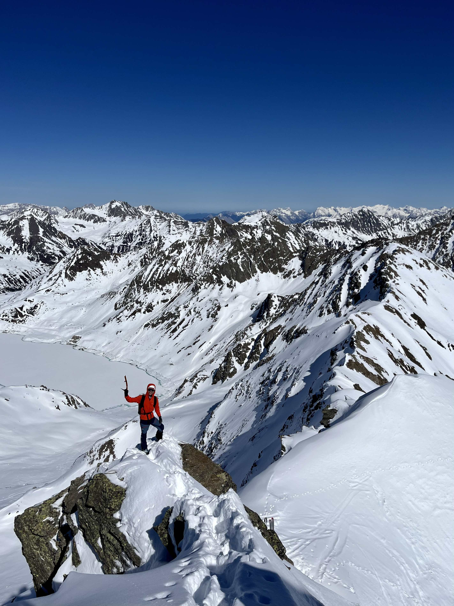
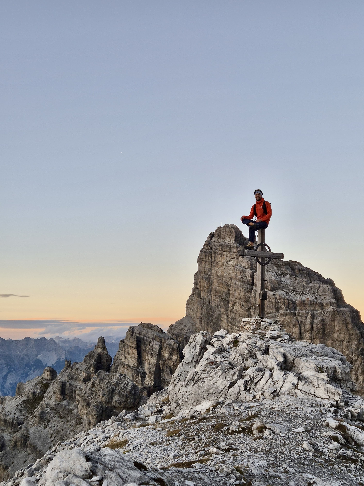
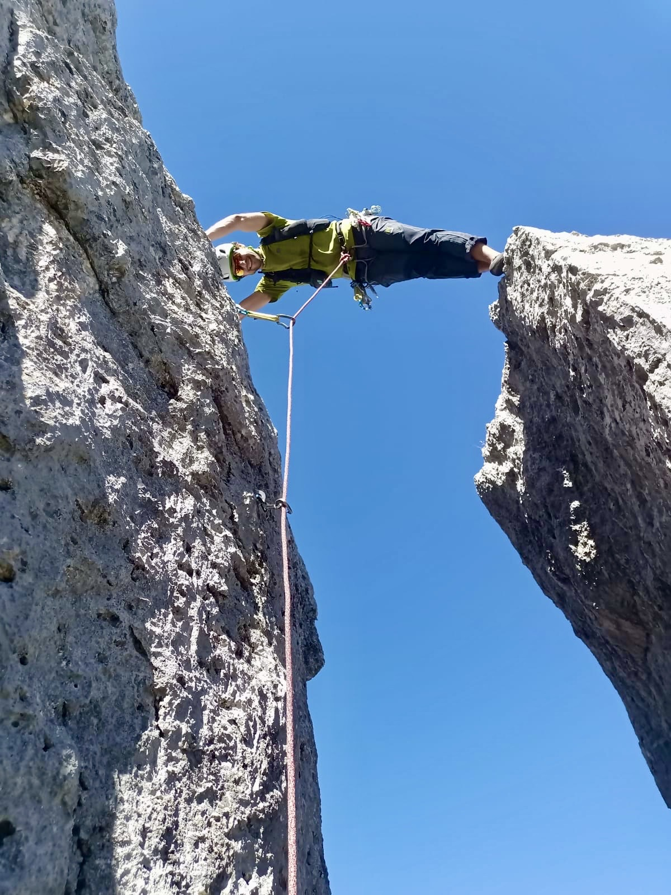
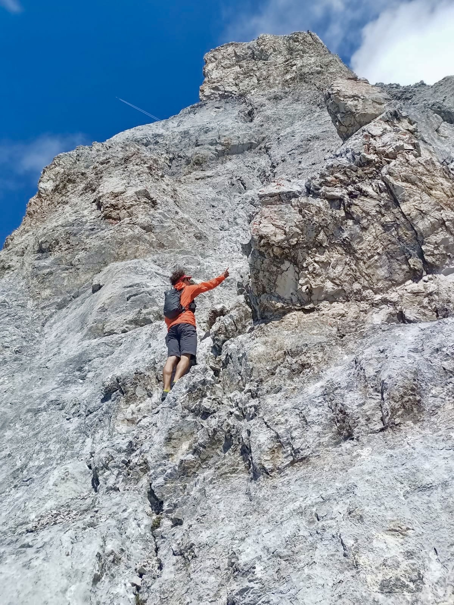
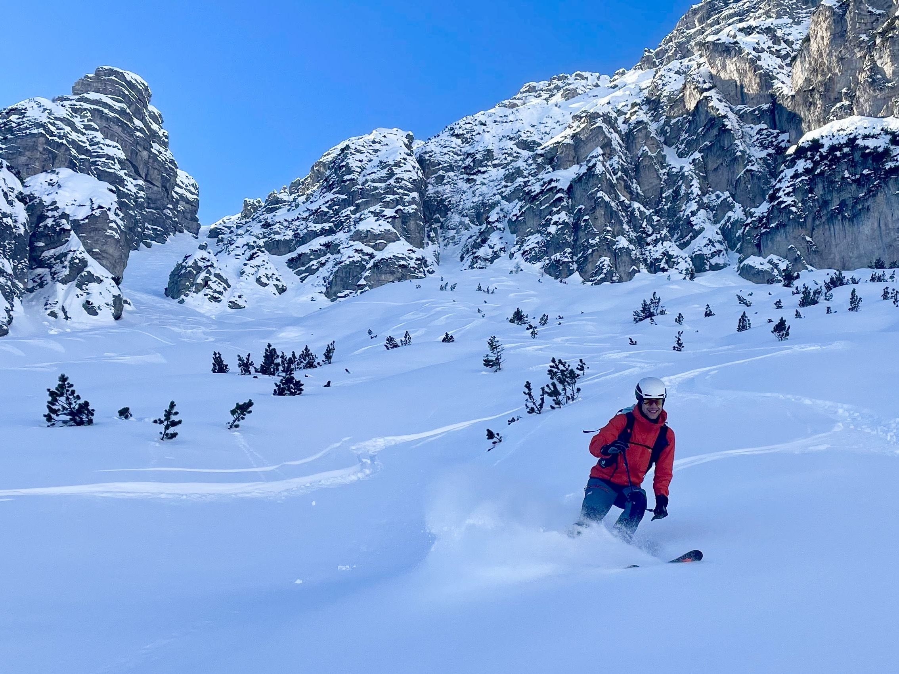
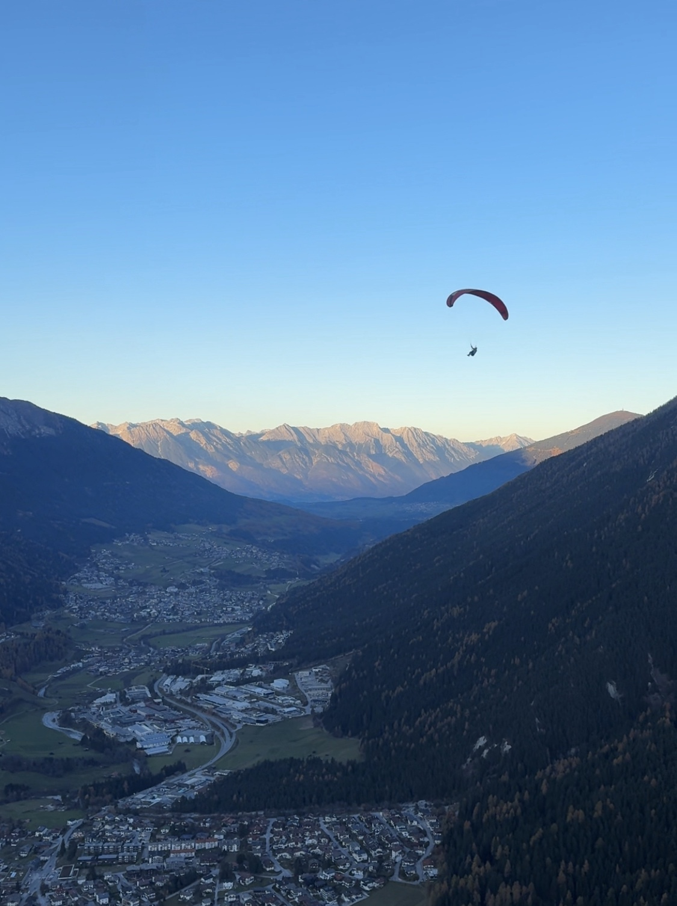
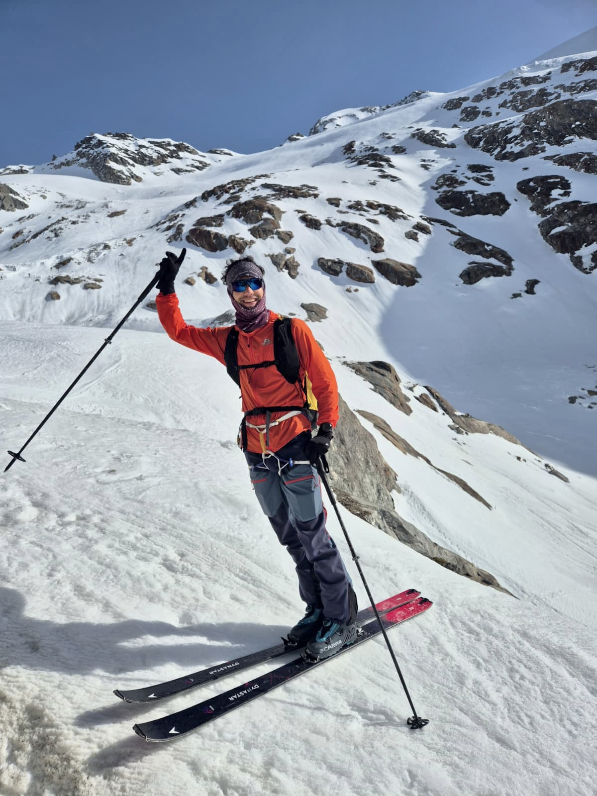

  
  
  
  

I love the feeling of remoteness, roughness and adventure in the mountains. I enjoy planning alpine adventures and exploring less frequented routes. In winter I enjoy ski-touring, in summer I enjoy ridge scrambling and light alpine climbs. My strengths are fast movement in alpine, rocky terrain up to UIAA grade 4 and planning and navigation in pathless, alpine environment. Recently, I started paragliding.

  
  
  

Currently I am living in Innsbruck, Tyrol. I grew up in the bavarian alps, in Garmisch-Partenkirchen.
I am grateful for all the amazing times I could share with friends in the mountains :) 

